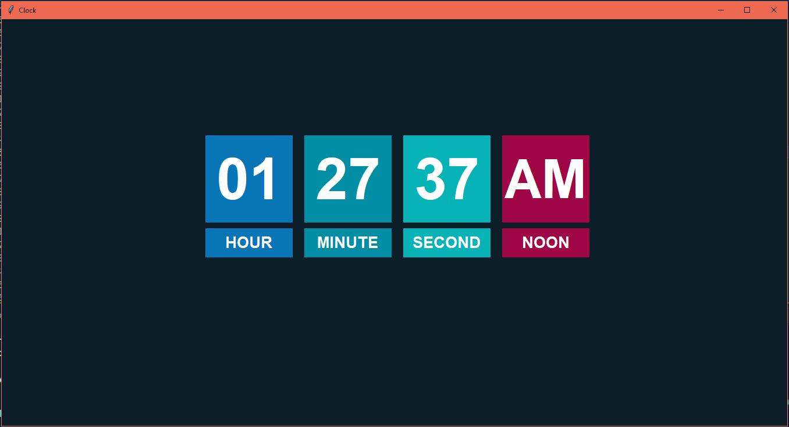
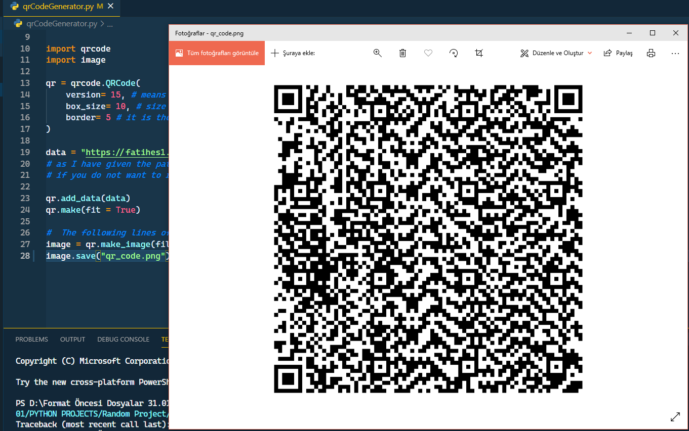
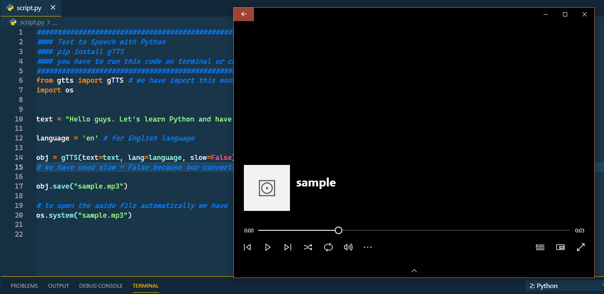
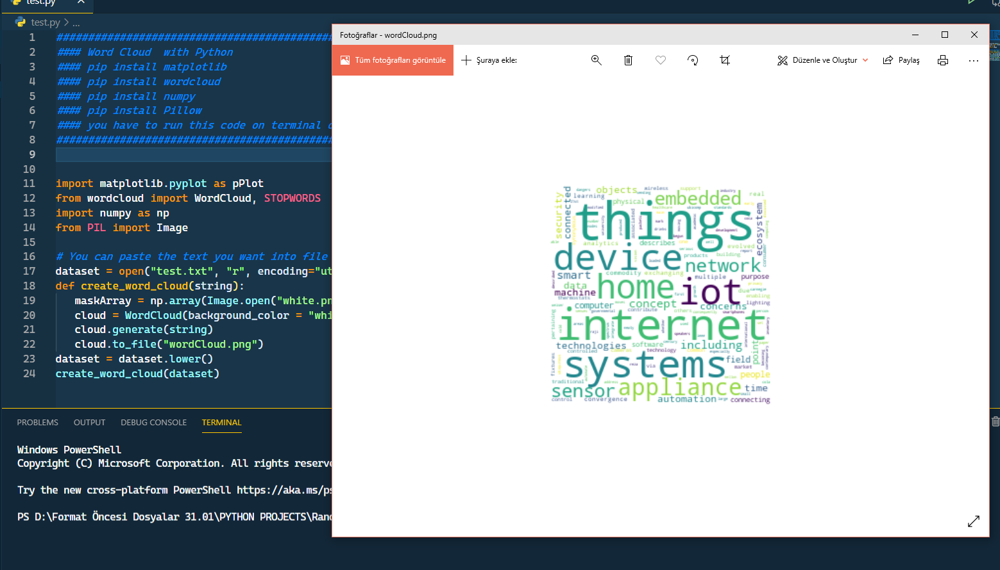
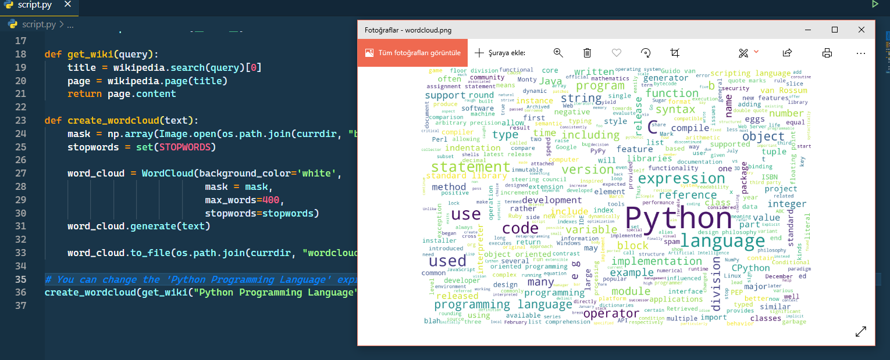

# Mixed-Python-Projects
Python projects in different fields.

<h2>Digital Clock</h2>

<h3>pip install tkinter</h3>
<h2>QR-Code Generator</h2>

<h3>pip install qrcode</h3>
<h3>pip install image</h3>
<h2>Text to Speech</h2>

<h3>pip install gTTS</h3>
<h2>Typing Speed Game</h2>
<h2>Word Cloud</h2>
<h3>pip install matplotlib</h3>
<h3>pip install wordcloud</h3>
<h3>pip install numpy</h3>
<h3>pip install Pillow</h3>

<h2>Word Cloud with Wikipedia</h2>

<h3>pip install wikipedia</h3>
<h3>pip install wordcloud</h3>
<h3>pip install numpy</h3>
<h3>pip install Pillow</h3>
